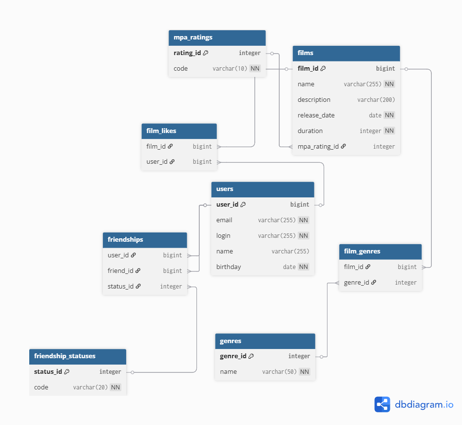

# java-filmorate
Template repository for Filmorate project.

## 🗄️ Database Schema



### Основные таблицы:
- `users` - пользователи
- `films` - фильмы
- `mpa_ratings` - рейтинги MPA
- `genres` - жанры
- `film_genres` - связь фильмов и жанров
- `film_likes` - лайки фильмов
- `friendships` - дружеские связи
- `friendship_statuses` - статусы для дружеских связей

**Получение всех фильмов:**
```sql
SELECT * FROM films ORDER BY name;
```

**Поиск фильмов по жанру:**
```sql
SELECT f.*, m.code as mpa_rating
FROM films f
JOIN mpa_ratings m ON f.mpa_rating_id = m.rating_id
JOIN film_genres fg ON f.film_id = fg.film_id
JOIN genres g ON fg.genre_id = g.genre_id
WHERE g.name = 'COMEDY';
```

### Операции с пользователями

**Получение друзей пользователя:**
```sql
SELECT u.user_id, u.login, u.name 
FROM users u
JOIN friendships f ON u.user_id = f.friend_id
WHERE f.user_id = 1 AND f.status_id = 2;
```

**Добавление нового пользователя:**
```sql
INSERT INTO users (email, login, name, birthday)
VALUES ('test@mail.ru', 'user123', 'Иван Иванов', '1990-05-15');
```